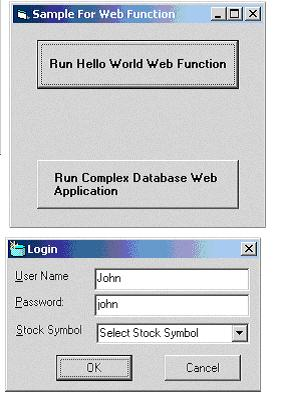



## Web Function

### Description

Web function (WF) is a simple technology, which allows any client to execute a function remotely on a web server and return the result back to the client over HTTP.

Few usage examples:

-By using Web function you will be able to execute a database call and return the result back over the port 80, thus by passing the firewall problems.

-Web Function allows exposing standard methods or services, which can be used by any client.

-Perform custom messaging services like pop up a small message box on the client machine once the reports have been updated on the server.

-What ever you can think of?

....For more information you can read the word document in the zip file or you can go to the HTML version by going to http://www.xSolveNet.com/Articles/
 
### More Info
 
The Zip file consists of a simple client app and also the WF server app. After unzipping the code open the VB project under WFClient folder and run the application. If you want to set up your own WFServer then follow the instruction in the Word document.

             |
---                |---
**Submitted On**   |2001-05-30 11:17:46
**By**             |[Shantanu Nag](https://github.com/Planet-Source-Code/PSCIndex/blob/master/ByAuthor/shantanu-nag.md)
**Level**          |Advanced
**User Rating**    |4.7 (28 globes from 6 users)
**Compatibility**  |VB 6\.0, ASP \(Active Server Pages\) , VBA MS Access
**Category**       |[Internet/ HTML](https://github.com/Planet-Source-Code/PSCIndex/blob/master/ByCategory/internet-html__1-34.md)
**World**          |[Visual Basic](https://github.com/Planet-Source-Code/PSCIndex/blob/master/ByWorld/visual-basic.md)
**Archive File**   |[Web Functi202885302001\.zip](https://github.com/Planet-Source-Code/shantanu-nag-web-function__1-23599/archive/master.zip)

